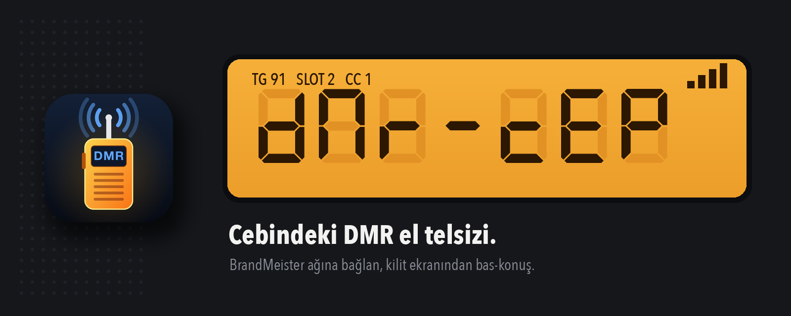
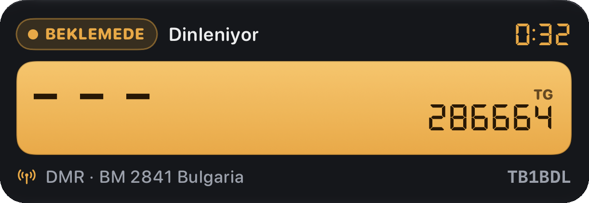

<p align="center">
  
</p>

<p align="center">
  
  
  
  
</p>

**DMR Cep**, iPhone'u BrandMeister ve diğer DMR ağlarına bağlanan bir el telsizine çevirir. Bir hotspot ya da telsiz gerekmez: internet varsa konuşma grubuna girer, bas-konuş tuşuna basar, konuşursun. Karşıdaki istasyonlar seni gerçek bir DMR telsizi gibi duyar ve ekranlarında çağrı işaretini görür.

[DroidStar](https://github.com/nostar/DroidStar) (AD8DP) ve onun iOS sürümü [Droidstar-DMR](https://github.com/rohithzmoi/Droidstar-DMR) (VU3LVO) üzerine kuruludur. TB1BDL tarafından günlük kullanım için yeniden elden geçirildi: bağlantısı kopmayan, sesi temiz giden, Türkçe konuşan bir telsiz.

---

## Bir bakışta

<table>
<tr>
<td width="50%" valign="top">

### 📻 El telsizi gibi
Kehribar LCD'de 7 segmentli TG numarası, köşede sinyal çubukları, kanal şeridi gibi dizilmiş favori konuşma grupları ve ortada büyük yuvarlak bas-konuş tuşu. O an konuşanın çağrı işareti ve adı ekranın ortasında.

### 🔒 Kilit ekranında
Apple **Push-to-Talk** ile kilit ekranından ve Dinamik Ada'dan bas-konuş; Bluetooth PTT aksesuarları da çalışır. **Canlı Etkinlik** kartı TG'yi, sunucuyu ve kimin konuştuğunu telefonu açmadan gösterir.

</td>
<td width="50%" valign="top">



<sub>Kilit ekranı kartı: dinleme süresi, TG, sunucu, çağrı işareti.</sub>

</td>
</tr>
</table>

## Özellikler

**Bağlantı**
- **Açılışta otomatik bağlanır**: son sunucuya ve konuşma grubuna, uygulamayı açar açmaz.
- **Kopmaz**: sunucu kapanırsa (MSTCL / MSTNAK) ya da 20 sn ses gelmezse kendiliğinden yeniden bağlanır; Wi-Fi ile mobil veri arasında geçerken hemen yeniden kayıt olur.
- **Kilitliyken de toparlar**: yeniden bağlanmayı beklerken arka plan sesi açık kalır, iOS uygulamayı dondurmaz; telefon cepteyken bağlantı kendiliğinden geri gelir. Testte uygulama 52 dakika arka planda ayakta kaldı, beş Wi-Fi ↔ mobil geçişinin hepsinde kendiliğinden bağlandı.
- **Bağlantı kalitesi göstergesi**: LCD köşesinde 4 çubuk. Dokununca gecikme (ms), kayıp ping ve son yayındaki kayıp çerçeve oranı. Kopmadan önce zayıfladığını görürsün.
- Bağlanınca kısa bir çan sesi.

**Kimlik**
- **Talker Alias**: karşı telsizlerin ekranında yalnızca DMR ID değil, "TB1BDL Tunca" gibi bir yazı çıkar. Gelen yayınların talker alias'ı da ekranda gösterilir.
- **Roger sesleri**, yayın başında ve sonunda farklı:
  - **Polis telsizi (CCIR)**: girişte 2-1-2-6-5, çıkışta 1-8-2-7-5; ton başına 100 ms. Türk emniyet telsizlerindeki çağrı sesi, kayıttan ölçülüp birebir kuruldu.
  - **5 ton ANI (ZVEI-1)**: DMR ID'nin son beş hanesi.
  - Başta ve sonda kısa bip, yalnız sonda bip ya da kapalı.
- İsteğe bağlı **telefon GPS'i** ile BrandMeister'a istasyon konumu (varsayılan kapalı).

**Ses**
- TX: gürültü kapısı, otomatik kazanç ve ses tonu seçimi (Doğal / İnce 300 Hz / Çok ince 500 Hz).
- RX: otomatik kazanç ve yumuşak sınırlayıcı; kısık gelen istasyonlar da duyulur.
- **Tekrar dinle**: gelen yayınlar ve kendi yayınların (karşının duyduğu hâliyle) kaydedilir; QSO listesinde her satırın yanında ▶.

**Konuşma grupları**
- Favoriler; adları BrandMeister'dan gelir, sıraları değiştirilebilir.
- TG yazarken adı anında görünür. 7 haneli numarada "Bu bir DMR ID gibi, özel arama mı?" diye sorar.

**Arayüz**
- Türkçe (varsayılan) ve İngilizce, Ayarlar'dan anında değişir.

## Tonlar nasıl gidiyor?

Roger bipleri ve 5 ton, ses olarak mikrofondan değil, AMBE+2 **ton çerçevesi** olarak gönderilir (TIA-102.BABA-1). Karşıdaki telsizin vocoder'ı tonu kendisi üretir, bu yüzden yazılım vocoder'ının robotikliğine uğramadan tertemiz çıkar.

| Sistem | 0 | 1 | 2 | 3 | 4 | 5 | 6 | 7 | 8 | 9 | tekrar | ton |
|---|---|---|---|---|---|---|---|---|---|---|---|---|
| CCIR (Hz) | 1981 | 1124 | 1197 | 1275 | 1358 | 1446 | 1540 | 1640 | 1747 | 1860 | 2110 | 100 ms |
| ZVEI-1 (Hz) | 2400 | 1060 | 1160 | 1270 | 1400 | 1530 | 1670 | 1830 | 2000 | 2200 | 2600 | 70 ms |

Polis telsizi kipinde giden dizi, karşı telsizin çözdüğü hâliyle ölçüldü:

| | 2 | 1 | 2 | 6 | 5 |
|---|---|---|---|---|---|
| Referans kayıt | 1198 Hz | 1125 Hz | 1198 Hz | 1541 Hz | 1447 Hz |
| DMR Cep | 1188 Hz | 1125 Hz | 1188 Hz | 1531 Hz | 1437 Hz |

<sub>Frekanslar ton çerçevesinin 31,25 Hz'lik adımlarına yuvarlanır.</sub>

## Neler değişti

DroidStar'ın iOS sürümüne göre DMR Cep'te eklenen ve düzeltilenler:

| Alan | Değişiklik |
|---|---|
| Bağlantı | Otomatik yeniden bağlanma (geri çekilmeli, 15 deneme), el sıkışmada tekrar gönderme, ağ değişiminde hemen yeniden kayıt, açılışta otomatik bağlanma, kilitliyken yeniden bağlanma, bağlantı kalitesi çubukları |
| Push-to-Talk | Apple PushToTalk: kilit ekranı, Dinamik Ada, Bluetooth PTT, konuşanın adı |
| Kilit ekranı | Canlı Etkinlik kartı (TG, sunucu, konuşan, süre) |
| TX sesi | Mikrofon tamponu 640 B → 4 KB (sesin %64'ü düşüyordu), mikrofon %10 → %100, gerçek örnekleme hızının ölçülmesi (48 ↔ 44,1 kHz), gürültü kapısı + otomatik kazanç, ses tonu süzgeci |
| RX sesi | TX sonrası sessiz kalan hoparlör düzeltildi, çıkışın üst üste açılması önlendi, otomatik kazanç + sınırlayıcı |
| Tonlar | Roger bipleri ve 5 ton, AMBE+2 ton çerçevesi olarak; polis telsizi (CCIR) ve ZVEI-1 kipleri; gelen ton çerçeveleri de çalınır |
| Kimlik | Talker Alias gönderme ve alma, telefon GPS'iyle konum |
| Kayıt | Gelen ve kendi yayınlarını tekrar dinleme (son 30) |
| Arayüz | Kehribar LCD'li el telsizi tasarımı, favori TG'ler, TG adı önizleme, yeni menü ve ayarlar, Türkçe, yeni ad, simge ve açılış ekranı, bağlanma çanı |

## Derleme

Gerekenler: Xcode 27 ve iOS için Qt **6.11.3** (6.7.x, Xcode 27 SDK'sıyla derlenmiyor).

```sh
# Qt, aqtinstall ile
aqt install-qt mac desktop 6.11.3 clang_64 -m qtmultimedia
aqt install-qt mac ios 6.11.3 ios -m qtmultimedia --autodesktop

mkdir build-ios && cd build-ios
~/Qt/6.11.3/ios/bin/qmake ../DroidStar.pro CONFIG+=sdk_no_version_check
make -f DroidStar.xcodeproj/qt_preprocess.mak   # Xcode'un yeni derleme sistemi bu adımı sıraya koymuyor
xcodebuild -project DroidStar.xcodeproj -scheme DroidStar -configuration Release \
  -destination 'generic/platform=iOS' \
  DEVELOPMENT_TEAM=<takım> PRODUCT_BUNDLE_IDENTIFIER=<paket kimliği> \
  ASSETCATALOG_COMPILER_APPICON_NAME=AppIconDMRCep build
```

<details>
<summary>Notlar ve tuzaklar</summary>

- Push-to-Talk için App ID'de **Push to Talk** ve **Push Notifications** yetenekleri açık olmalı (`DroidStar.entitlements`). Push Notifications olmadan framework `PTInstantiationError 3` verir.
- Canlı Etkinlik kartı ayrı bir Widget Extension'dır; derleme sonrası gömülür. Ayrıntı: [docs/live-activity-build.md](docs/live-activity-build.md).
- iOS'ta çoklu ortam arka ucu FFmpeg değil Darwin eklentisidir (`QTPLUGIN.multimedia = darwinmediaplugin`).
- aqt kurulumu yarım kalırsa `ios/bin/qmake` ve `target_qt.conf` içindeki host yollarını macOS kurulumuna yönlendirin.
- Uygulama cihazda `Library/Application Support/DroidStar/debug.log` tutar. Ses teşhisi için son yayın `tx_last_mic.wav` ve `tx_last_decoded.wav` olarak yazılır.
- iPhone mikrofonu, ses oturumu 48 kHz dese de 44,1 kHz verebilir; örnekleme hızı veriden ölçülür.

</details>

## Emeği geçenler

- **Doug McLain, AD8DP**: DroidStar
- **Rohith Namboothiri, VU3LVO**: Droidstar-DMR iOS sürümü
- **TB1BDL**: DMR Cep
- 7 segment yazı tipi [DSEG](https://github.com/keshikan/DSEG) (keshikan, SIL OFL 1.1)
- AMBE+2 ton çerçevesi düzeni için referans: [mbelib-neo](https://github.com/arancormonk/mbelib-neo)

## Lisans

GNU General Public License v3.0, bkz. [LICENSE](LICENSE). DSEG yazı tipi kendi lisansıyla gelir (`fonts/DSEG-LICENSE.txt`).

<details>
<summary>English</summary>

DMR Cep turns an iPhone into a DMR handheld for BrandMeister and other HomeBrew/MMDVM networks, no hotspot needed. Built on DroidStar (AD8DP) and the Droidstar-DMR iOS fork (VU3LVO), reworked by TB1BDL for daily use: auto-connect on launch and reliable auto-reconnect (also while locked), a link-quality meter, Apple Push-to-Talk with lock-screen / Dynamic Island control and a Live Activity card, DMR Talker Alias (TX and RX), roger beeps, a CCIR police-radio five-tone call-up (2-1-2-6-5 in, 1-8-2-7-5 out) and ZVEI-1 five-tone ANI, all sent as AMBE+2 tone frames, TX noise gate / AGC / voice-tone shaping, RX AGC, replay of received and own transmissions, favorite talk groups with live name lookup, optional phone GPS position, and a Turkish/English UI styled like an amber-LCD handheld. GPL-3.0.

</details>

<p align="center"><sub>73 de TB1BDL</sub></p>
